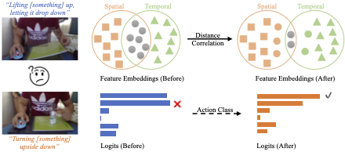

# AEDC
For the paper "Learning Discriminative Representations in Videos via Active Embedding Distance Correlation"

# Video classification with SlowFast/UniFormer

We currenent release the code and models for:

- [x] Tamporal Action 50
- [x] Something-Something V2

## Update

***09/01/2024***

**\[Initial commits\]:** 
Make a new repo. 

